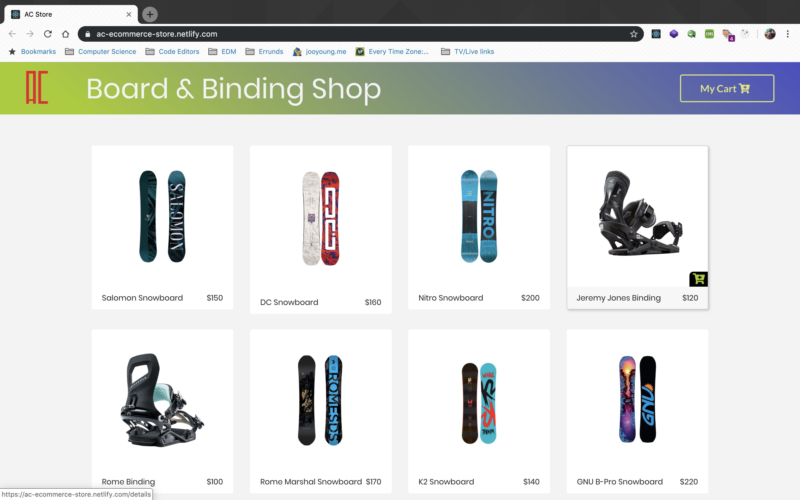
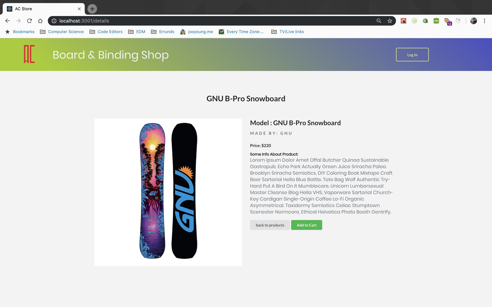
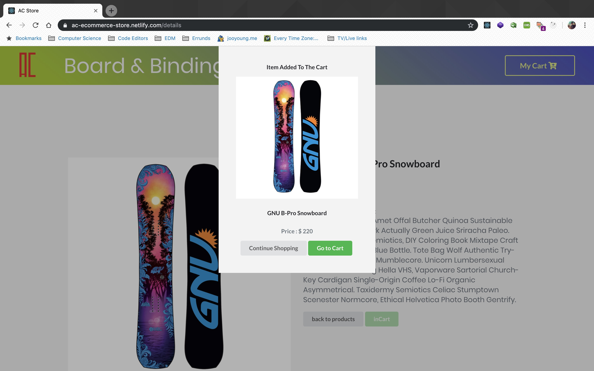
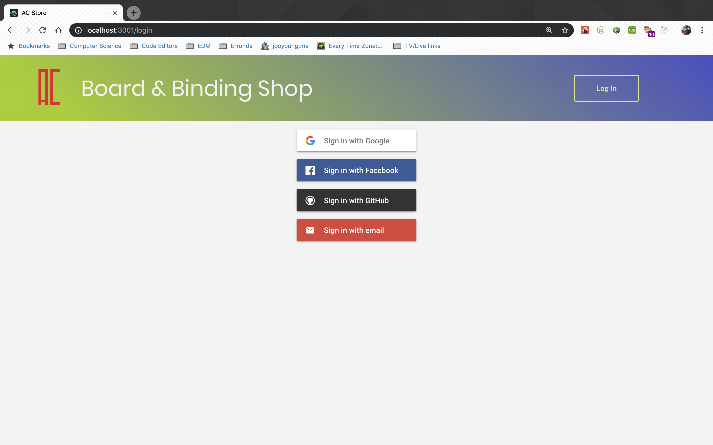
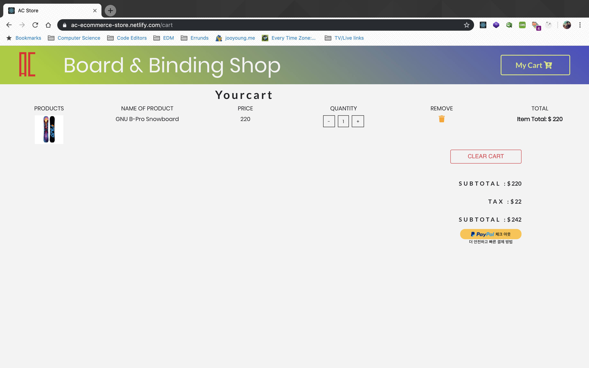
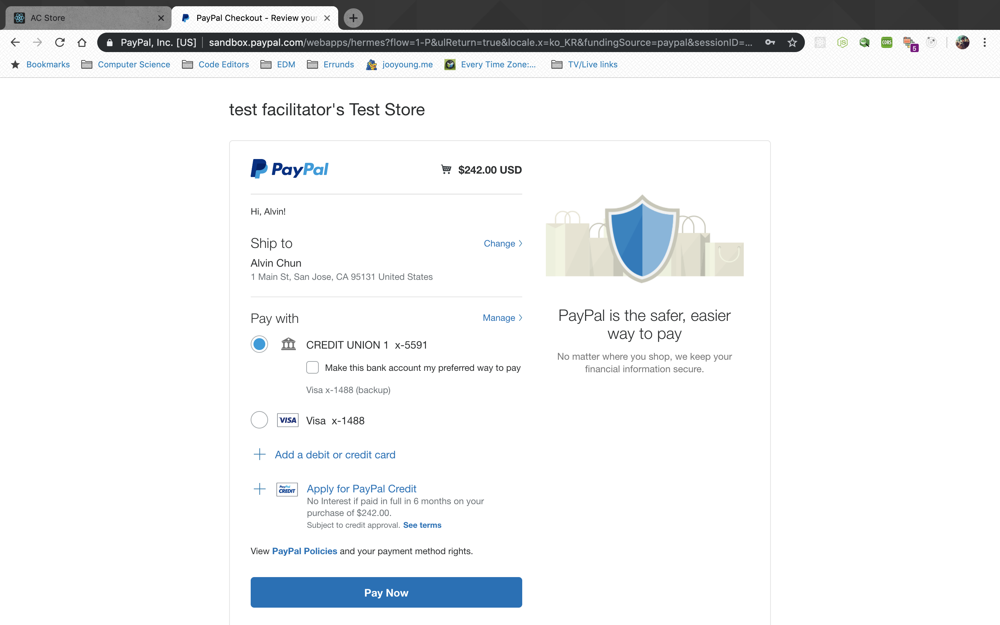

# AC Board & Binding Store

Link: https://ac-ecommerce-store.netlify.com

## Challenge

E-commerce Platform CRUD app for users to see the items information and add to cart to make payment with each authenticated users.

## Technologies

- React.js
- Context API
- Semantic UI React
- Styled Components
- CSS3
- Paypal


## Included Features

- User can log in with firbase authentication provided by Google.
- All users can view all listed items page in home directory, single item page, but only the authenticated users can add items to the cart and check out.
- Authenticated users can add items to the cart from the all items view pages (hompage) by hovering over the image to click on the cart icon fading in.

## React App setup

`$ create-react-app ac-react-store`

This command will generate all the boiler plate of react application

## Different routes of pages rendering from App.js

```javascript
function App() {
	
	return (
		<React.Fragment>
			<Navbar />
			<Switch>
				<Route exact path="/" component={ProductList} />
				<Route path="/details" component={Details} />
				<Route path="/cart" component={Cart} />
				<Route path="/" component={Login} />
				<Route component={Default} />
			</Switch>
			<Modal />
		</React.Fragment>=
	);
}
```

App.js component manages to return all different components including ProductList, Details, Cart, Login and Default components at different routes.


## Using functions and presenting data with context API

```javascript
	render() {
		return (
			<ProductContext.Provider
				value={{
					...this.state,
					handleDetail: this.handleDetail,
					addToCart: this.addToCart,
					openModal: this.openModal,
					closeModal: this.closeModal,
					increment: this.increment,
					decrement: this.decrement,
					removeItem: this.removeItem,
					clearCart: this.clearCart
				}}
			>
				{this.props.children}
			</ProductContext.Provider>
		);
	}
}

const ProductConsumer = ProductContext.Consumer;

export { ProductProvider, ProductConsumer };
```

I stored all the data into objects in array in data.js file. In context.js file, for the state management, I used context API where it receives all the data into state and save them into Provider by sending through props and use them through Consumer in other components more easily and conveniently. Functions are also written in context.js to use functions more easily.


## Main-page

The main page renders










## Models relations

## Authentication set up

## Problems

## Test Driven Development:
